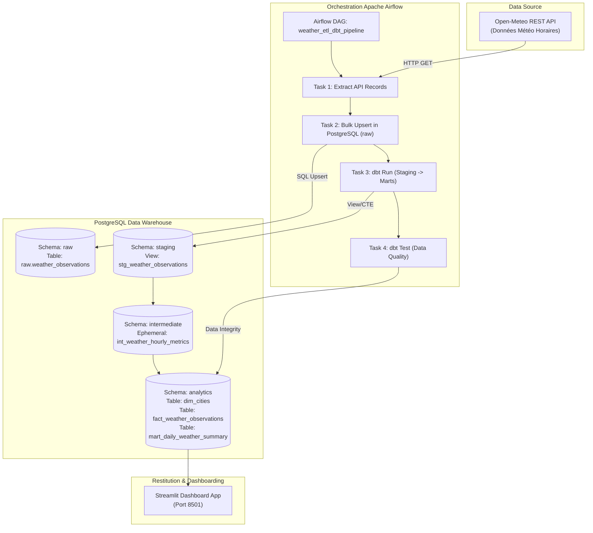

# Pipeline ETL / ELT End-to-End avec Apache Airflow, dbt & PostgreSQL

Projet complet de Data Engineering illustrant la construction d'un pipeline de données robuste de bout en bout :

Ingestion d'une **API publique REST (Open-Meteo)** ➔ Ingestion dans **PostgreSQL** (`raw`) ➔ Transformations SQL structurées avec **dbt (data build tool)** ➔ Data Quality & Testing ➔ Orchestration automatisée avec **Apache Airflow** ➔ Restitution visuelle sur **Streamlit**.

---

## Architecture du Pipeline



---

## Stack Technique

- **Langage** : Python 3.11+ / SQL
- **Orchestrateur** : Apache Airflow 2.10 (DAGs, Operators, Scheduling)
- **Transformations & Modélisation** : dbt (data build tool) 1.9 (`dbt-postgres`)
- **Entrepôt de Données** : PostgreSQL 15 (Schémas `raw`, `staging`, `intermediate`, `analytics`)
- **Conteneurisation** : Docker & Docker Compose
- **Visualisation** : Streamlit & Plotly
- **Tests Unitaires & Qualité** : Pytest, dbt tests (`unique`, `not_null`, `relationships`, singular tests)

---

## Modélisation de l'Entrepôt (Schéma en Étoile)

L'entrepôt suit l'architecture médaillon / dbt :

1. **`raw.weather_observations`** : Zone d'atterrissage brute (données brutes + payload JSONB).
2. **`staging.stg_weather_observations`** : Nettoyage, typage strict des données, déduplication (fenêtrage `ROW_NUMBER()`).
3. **`intermediate.int_weather_hourly_metrics`** : Enrichissement métrique (conversion Fahrenheit, catégories thermiques, conversion des codes WMO en libellés explicites).
4. **`analytics.dim_cities`** : Table de dimension référençant les villes (latitude, longitude, timezone).
5. **`analytics.fact_weather_observations`** : Table de faits horodatée reliant les mesures physiques à la dimension ville.
6. **`analytics.mart_daily_weather_summary`** : Data Mart d'agrégation quotidienne (températures min/max/moyenne, amplitude thermique, précipitations cumulées, vent max).

---

## Démarrage Rapide

### Option A : Lancement avec Docker Compose (Recommandé)

```bash
# 1. Cloner le projet et naviguer dans le répertoire
cd "Pipeline ETL avec Airflow + dbt"

# 2. Démarrer PostgreSQL et Airflow en arrière-plan
docker-compose up -d

# 3. Accéder à l'interface d'Airflow
# Webserver : http://localhost:8080 (Identifiants: airflow / airflow)
```

### Option B : Exécution et Test Local Standalone

```bash
# 1. Installer les dépendances Python
pip install -r requirements.txt

# 2. Initialiser PostgreSQL localement (si pas sous docker)
psql -U airflow -d weather_dwh -f scripts/init_db.sql

# 3. Lancer l'exécution complète du pipeline via le script d'automatisation
# Sur Windows (PowerShell) :
.\scripts\run_pipeline.ps1

# Ou directement via Python / dbt CLI :
python -c "from airflow.dags.utils.api_client import WeatherAPIClient; from airflow.dags.utils.db_helpers import bulk_upsert_raw_weather; bulk_upsert_raw_weather(WeatherAPIClient().extract_all_cities())"
dbt run --project-dir dbt_project --profiles-dir dbt_project
dbt test --project-dir dbt_project --profiles-dir dbt_project
```

### 4. Lancer le Dashboard Streamlit

```bash
streamlit run dashboards/app.py
```

---

## Qualité des Données & Testing

Le pipeline intègre une stratégie de Data Quality à plusieurs niveaux :

- **Tests de Schéma dbt** : Validation systématique de l'unicité et de la non-nullité des clés (`observation_id`, `city_key`, `fact_weather_key`, `daily_summary_key`).
- **Test de Clé Étrangère** : Validation de l'intégrité référentielle entre la table de faits et la dimension des villes (`relationships`).
- **Test Singulier Personnalisé (`tests/assert_temperature_range.sql`)** : Assertion métier vérifiant qu'aucune température enregistrée ne sort de la plage physiquement acceptable (-60°C à +60°C).
- **Tests Unitaires Pytest** : Validation mockée du client d'extraction API (`pytest tests/`).

---

## Structure du Répertoire


```
.
├── airflow/
│   └── dags/
│       ├── weather_etl_dag.py         # DAG principal Airflow
│       └── utils/
│           ├── api_client.py          # Client API Open-Meteo avec retries
│           └── db_helpers.py          # Connecteur et Upsert PostgreSQL
├── dbt_project/
│   ├── dbt_project.yml                # Config projet dbt
│   ├── profiles.yml                   # Target Postgres dbt
│   ├── models/
│   │   ├── staging/                   # Staging models & schemas
│   │   ├── intermediate/              # Intermediate transformations
│   │   └── marts/                     # Data Marts (dim_cities, fact_weather, mart_daily_summary)
│   └── tests/                         # Tests dbt singuliers
├── dashboards/
│   └── app.py                         # Interface Streamlit
├── scripts/
│   ├── init_db.sql                    # Initialisation des schémas PostgreSQL
│   └── run_pipeline.ps1               # Script PowerShell d'exécution locale
├── tests/                             # Tests unitaires Pytest
├── docker-compose.yml                 # Services Docker PostgreSQL + Airflow
├── requirements.txt                   # Dépendances Python
└── README.md                          # Documentation officielle
```
